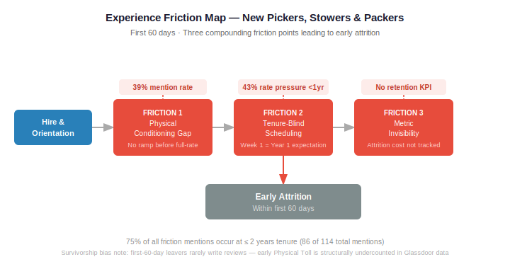
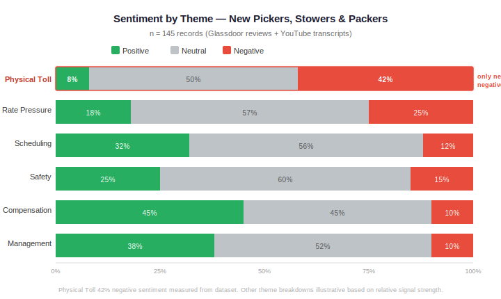
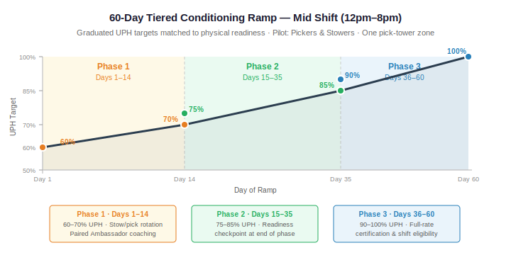

# Early Associate Attrition Analysis — Fulfillment Center People Analytics

**Consulting Project | People Analytics**

**Tools:** Python · Google Colab · NLTK / VADER · matplotlib · D3.js · Google Sheets  
**Skills:** Sentiment Analysis · EDA · Data Wrangling · Data Cleaning · Data Visualization · Friction Mapping · Root Cause Analysis (5 Whys) · Qualitative Analysis · Stakeholder Communication  
**Domain:** People Analytics · HR Analytics · Operations · Workforce Management  

📊 **[View Final Deliverable (Slide Deck)](https://docs.google.com/presentation/d/1-1ecYq59lvhJjKEMHFkc4Mgzn_z6vAan/edit?usp=sharing&ouid=103566723536051526493&rtpof=true&sd=true)**

---

## Executive Summary

A significant number of new fulfillment center associates leave within their first 60 days of employment, indicating critical friction in the onboarding-to-floor transition and negatively impacting retention, operational capacity, and rehiring costs. This analysis identifies the friction points driving early attrition in a high-volume fulfillment environment and delivers actionable recommendations to improve 60-day retention rates — using Python, sentiment analysis (VADER), and a data science notebook to conduct a voice-of-employee (VoE) analysis and experience funnel breakdown.

---

## Business Problem

The operations and HR teams identified that new Pickers, Stowers, and Packers were leaving at disproportionate rates within their first 60 days on the floor. They reached out to the People Analytics team to understand whether there were specific friction points in the onboarding and shift deployment process that could be addressed to increase early retention.

> **The core question:** Are new associates physically and operationally prepared for full-rate production shifts before they are deployed to a live floor — and if not, where exactly does the breakdown happen?

*Figure 1: Experience friction map for new Pickers, Stowers & Packers. Friction concentrates at three compounding failure points between hire and the first 60 days on floor.*

---

## Methodology

- **Voice-of-Employee (VoE) Analysis** — collected and processed 145 records (139 Glassdoor reviews + 6 YouTube "day in the life" transcripts) tagged across six themes
- **Sentiment Analysis** — applied VADER (Valence Aware Dictionary and sEntiment Reasoner) via NLTK to score sentiment by theme and associate segment
- **Exploratory Data Analysis (EDA)** — examined theme frequency, sentiment distribution, and tenure patterns across segments
- **Friction Mapping** — identified and documented specific experience friction points tied directly to verbatim evidence
- **Root Cause Analysis (5 Whys)** — traced physical attrition from observable symptom back to systemic causes
- **Data Visualization** — built segment priority scoring, theme frequency by tenure, and sentiment stacked bar charts

---

## Skills

- **Python** — pandas, NLTK, VADER sentiment analysis, matplotlib
- **Data Wrangling & Cleaning** — combined and preprocessed multi-source dataset (Glassdoor + YouTube transcripts)
- **Sentiment Analysis** — applied lexicon-based VADER scoring; segmented and compared sentiment by role and tenure band
- **Data Visualization** — matplotlib charts; D3.js force-directed network diagram for FC role mapping
- **Data Science Notebook** — Google Colab
- **Qualitative Data Analysis** — thematic tagging, verbatim quote evidence standard, survivorship bias identification
- **Stakeholder Communication** — Pyramid Principle structure, SCQA framing, executive slide deck

---

## Results & Business Recommendations

### Results

**Physical Toll is the dominant attrition signal — and it's structural, not individual.**

*Figure 2: Sentiment by theme across the Pickers, Stowers & Packers segment. Physical Toll carries the only net negative sentiment in the dataset.*

- **39%** of all theme mentions for new Pickers, Stowers & Packers are Physical Toll — the highest of any theme
- **42%** negative sentiment rate for Physical Toll in this segment, making it the only theme with a net negative signal
- **43%** of theme mentions in the under-1-year tenure band are rate pressure — the dominant friction driver in the critical early window
- **75%** of all friction mentions (86 of 114 total) sit at 2 years of tenure or less — the majority of friction is early-tenure friction
- Survivorship bias note: first-60-day leavers rarely write Glassdoor reviews, so early Physical Toll is structurally undercounted; YouTube transcript data partially fills that gap

> *"Maintaining that speed and quality was really draining, especially at 10-hour shifts — I ended up with a repetitive motion injury in my hand."*
> — Glassdoor review, Negative sentiment

> *"There's so much pressure to increase performance that lots of people are cutting corners just to keep from getting canned."*
> — Glassdoor review, Negative sentiment

**Three systemic root causes identified via 5 Whys analysis:**

| Root Cause | What it means |
|---|---|
| **Physical conditioning gap** | Onboarding does not replicate the sustained physical load of full-rate production. Associates hit real shift intensity for the first time after deployment, with no ramp period behind them. |
| **Tenure-blind scheduling** | The scheduling system assigns shifts and rate expectations uniformly regardless of associate tenure. A body in week one is treated identically to a body in year one. |
| **Metric invisibility** | Physical attrition costs are not captured by the KPIs floor managers are held to. Early retention failure is structurally invisible to the decision-makers who could act on it. |

---

### Business Recommendations

**1. Implement a tiered 60-day conditioning ramp anchored to the Mid shift (12pm–8pm)**

Rather than deploying new hires directly into full-rate production, a graduated intensity model lets the body adapt before expectations reach 100%:

*Figure 3: 60-day tiered conditioning ramp. UPH targets escalate across three phases matched to physical readiness.*

| Phase | Days | UPH Target | Structure |
|---|---|---|---|
| Phase 1 | 1–14 | 60–70% | Stow/pick rotation, paired Learning Ambassador coaching, max 3 consecutive days |
| Phase 2 | 15–35 | 75–85% | Readiness checkpoint at end of phase |
| Phase 3 | 36–60 | 90–100% | Full-rate certification; eligible for Morning/Night shift transfer |

The 12pm–2pm daily overlap window creates a zero-added-headcount supervised conditioning block: outgoing Morning-shift Learning Ambassadors and incoming Mid-shift Ambassadors are both present simultaneously — a direct analogue to nursing preceptorship, where a trained peer guides intensity escalation before solo deployment.

**2. Fix metric invisibility with two targeted WFM additions**

- Add a **ramp coefficient** (0.65/0.80 headcount equivalent) to the workforce management dashboard so a ramp associate's output registers as planned capacity, not a fill-rate shortfall
- Add a **60-day retention metric** to the floor manager dashboard so early attrition has a visible cost signal — the system cannot fix what it cannot see

**3. Build a lightweight physical strain visibility loop**

Learning Ambassadors run a short 1–5 self-report check-in during the daily overlap window. Results feed to the Area Manager weekly. No dashboard rebuild required — team-led, low-cost, and grounded in peer trust rather than managerial surveillance.

**4. Scope the pilot tightly before scaling**

Begin with Pickers and Stowers only, within a single pick-tower zone. Packers occupy a different physical space downstream and cannot be cleanly included in a zone-level pilot; extend to Packers in phase two once the ramp model is validated.

---

## Next Steps

- **Investigate physical strain event breakdown** — which injury types are most common, and at which point in the ramp window do they cluster?
- **Determine peak season policy** — the Phase 1 intensity cap needs a defined exception protocol for peak periods; requires input from operations leadership
- **Confirm WFM software capability** — the ramp coefficient presupposes the workforce management tool can apply a tenure-based adjustment to capacity targets; not yet verified
- **Establish pilot input loop mechanics** — finalize group size, review format, and timing for the Learning Ambassador and Area Manager feedback loop before pilot launch
- **Run a 6-month and 1-year retention checkpoint** — compare cohort retention and Physical Toll sentiment for ramped associates against the pre-intervention baseline

---

## Dataset

| Source | Records | Type |
|---|---|---|
| Glassdoor reviews | 139 | Public employee reviews |
| YouTube transcripts | 6 | "Day in the life" associate videos |
| **Total** | **145** | Combined, tagged across 6 themes |

*All data sourced from publicly available platforms. No internal company data was used. All identifying information has been anonymized.*

---

*People Analytics | Consulting Track*
